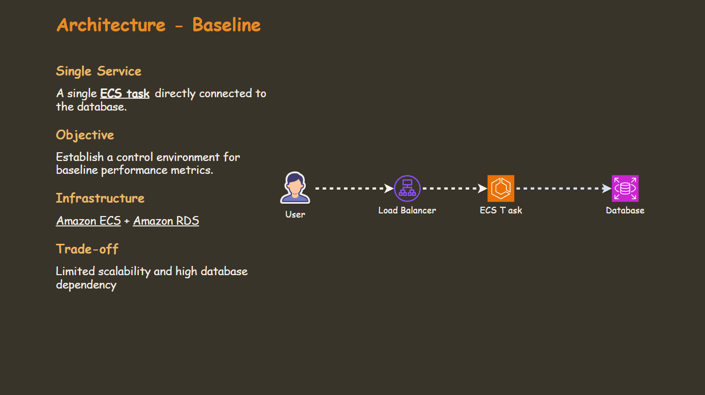
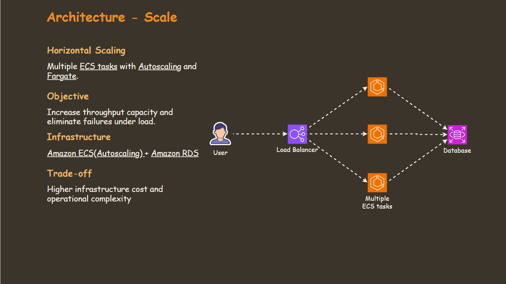
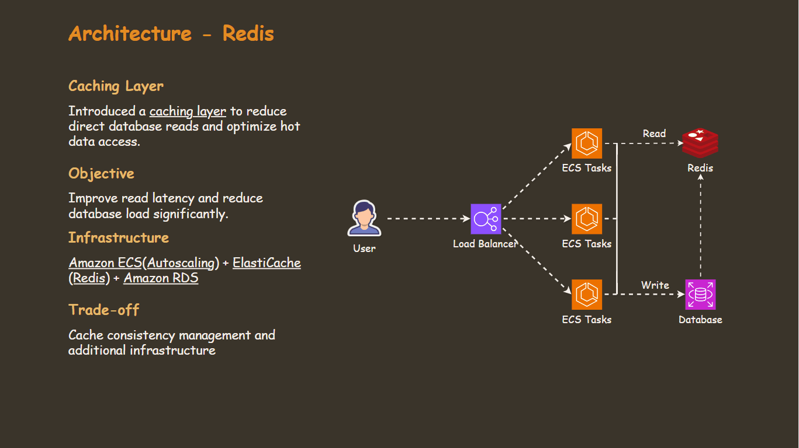
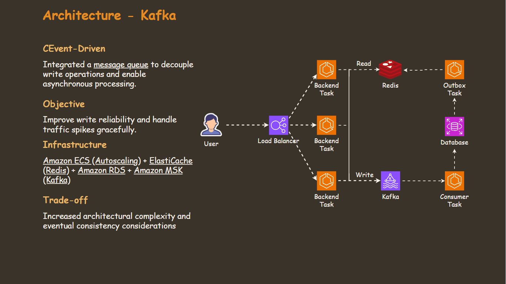
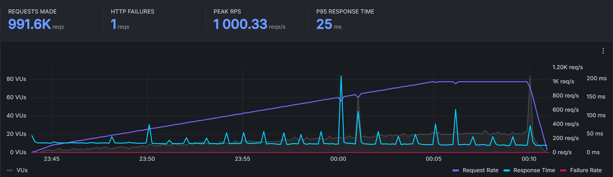

# Automated Architecture Benchmark (ECS)

**One Pipeline. Four Designs. Real Metrics.**

Welcome to visit my project website 👉 [website](https://ecs-benchmark.arguswatcher.net/)

      

- [Automated Architecture Benchmark (ECS)](#automated-architecture-benchmark-ecs)
  - [Motivation](#motivation)
  - [Results](#results)
  - [Four Designs](#four-designs)
  - [One Pipeline](#one-pipeline)
  - [Load Test](#load-test)
  - [Cost \& FinOps](#cost--finops)
  - [Debug Lessons](#debug-lessons)

---

## Motivation

Architecture advice is often theoretical — "add caching," "use a message queue" — without data to back it up. This project answers a practical question:

**How much does each architectural decision actually move the needle under real load?**

> Four designs. One automated pipeline. Identical traffic conditions. Real numbers.

---

## Results

Four architectures were tested in progression — Baseline, Auto-Scaling, Redis Caching, and Kafka — each addressing a limitation of the previous.

**Baseline → Kafka:**

- **+213% Throughput Improvement** — 320 → 1,000 RPS
- **-99% Latency Reduction** — 3,000ms → 25ms (p95)
- **~0% Request Failures** — nearly eliminated at 1,000 RPS
- **-67% Database CPU Reduction** — 48.6% → 15.8%

---

**Technical Comparison** - [Load Testing Snapshot](https://simonangelfong.grafana.net/dashboard/snapshot/vm8GHz4ne3ej2IijhAXtitw74oAXRSKr?orgId=1&from=2026-02-16T05:45:00.000Z&to=2026-02-16T06:20:00.000Z&timezone=browser&refresh=5s)

| Architecture | Peak RPS | HTTP Failures | P95 Latency | ECS Tasks (Peak) | DB CPU |
| ------------ | -------- | ------------- | ----------- | ---------------- | ------ |
| Baseline     | 320      | 34.6%         | 3,000ms     | 1                | 19.2%  |
| Scale        | 1,000    | ~0%           | 70ms        | 18               | 48.6%  |
| Redis        | 1,000    | ~0%           | 75ms        | 16               | 34.9%  |
| Kafka        | 1,000    | ~0%           | 25ms        | 10               | 15.8%  |

**Business Impact**

| Architecture | Business Continuity | DB Overload Risk | Operational Cost | Complexity |
| ------------ | ------------------- | ---------------- | ---------------- | ---------- |
| Baseline     | ❌ Low              | 🔴 High          | 🟢 Low           | 🟢 Low     |
| Scale        | 🟢 High             | 🟠 Medium–High   | 🔴 High          | 🟠 Medium  |
| Redis        | 🟢 High             | 🟡 Medium        | 🟠 Medium        | 🟠 Medium  |
| Kafka        | 🟢 Very High        | 🟢 Low           | 🟠 Medium        | 🔴 High    |

[Metric Analysis](./docs/metric/metric.md) | [Testing & SLOs](./docs/slo/slo.md)

---

## Four Designs

Each architecture addresses a limitation of the previous, tested under identical conditions.

- Baseline: Single task connected to RDS
  

- Scale: Multiple tasks with autoscaling
  

- Redis: Cache layer for read workload
  

- Kafka: Event-driven layer for write workload
  

[System Design](./docs/system_design/system_design.md)

---

## One Pipeline

One automated workflow runs across all four designs — ensuring every benchmark is provisioned, tested, and torn down under identical conditions.

| Step | Action                   | Tool       |
| ---- | ------------------------ | ---------- |
| 1    | Automate Unit testing    | Pyest      |
| 2    | Upload images to AWS ECR | Terraform  |
| 3    | Provision infrastructure | Terraform  |
| 4    | Validate deployment      | Smoke test |
| 5    | Load testing             | k6         |
| 6    | Tear down infrastructure | Terraform  |

[GitHub Actions Pipeline](./docs/pipeline/pipeline.md) | [Terraform (IaC)](./docs/iac/iac.md)

## Load Test

Each architecture was tested under identical conditions using a mixed read/write k6 script (`1:1` ratio to expose async writes), sourced from AWS Montreal.

| Phase       | Duration | Target RPS                                 |
| ----------- | -------- | ------------------------------------------ |
| Warm-up     | 1 min    | 0 → 50 RPS                                 |
| Ramp-up     | 20 min   | 50 → 500 RPS (read) + 50 → 500 RPS (write) |
| Peak / Soak | 5 min    | 1,000 RPS combined                         |
| Cool-down   | 1 min    | 500 → 0                                    |

**SLO thresholds applied during test:**

- HTTP failure rate < 1%
- p95 latency < 300ms

---

## Cost & FinOps

FinOps practices applied:

- ECS auto-scaling,
- automated tear-down after every run,
- and cost allocation tags per architecture.

Infrastructure exists only during the ~27-minute test window.

**Monthly equivalent (production estimate):**

| Architecture | Est. Monthly | Per Benchmark Run | Cost Driver                                           |
| ------------ | ------------ | ----------------- | ----------------------------------------------------- |
| Baseline     | ~$145        | ~$0.09            | ALB + NAT + RDS + 1 Fargate task                      |
| Scale        | ~$819        | ~$0.50            | 18 Fargate tasks at peak                              |
| Redis        | ~$753        | ~$0.46            | 16 Fargate tasks + ElastiCache                        |
| Kafka        | ~$626        | ~$0.39            | 10 Fargate tasks + ElastiCache + MSK 3-broker cluster |

> - Scale is the most expensive ($819/mo) due to 18 Fargate tasks at peak — real production cost would be lower with average-based scaling.
> - Kafka ($626/mo) is cheaper than both Scale and Redis despite the fixed MSK broker cost, because fewer Fargate tasks are needed; it also eliminates DB overload risk.
> - Redis ($753/mo) reduces DB CPU load but carries a higher task count than Kafka without the async write benefit.
> - Storage and ALB LCU charges excluded — see [FinOps & Cost](docs/cost.md) for full breakdown.

---

## Debug Lessons

**Auto-scaling**

- **Issue:** Tasks provisioned too slowly during traffic ramp-up, causing high failure rates before scaling could catch up
- **Root Cause:** CPU threshold set at 60% — by the time the alarm fired, tasks were already saturated; ECS also needs ~30–60s to launch a new Fargate task, so a late trigger compounds the lag
- **Fix:** Lowered threshold to 40% so scaling triggers earlier, giving Fargate enough lead time to provision tasks ahead of saturation

**Cost Allocation Tags returned no results in Cost Explorer**

- **Issue**: `Cost Explorer` returned no results when filtering by tags, even though tags were defined in `Terraform`
- **Root Cause**: The `GitHub Actions` variable for the tag value was empty, resulting in a tag with a blank value in AWS
- **Fix**: Validate tag values (not just keys); add workflow input checks or a Terraform validation block to fail on empty required values
