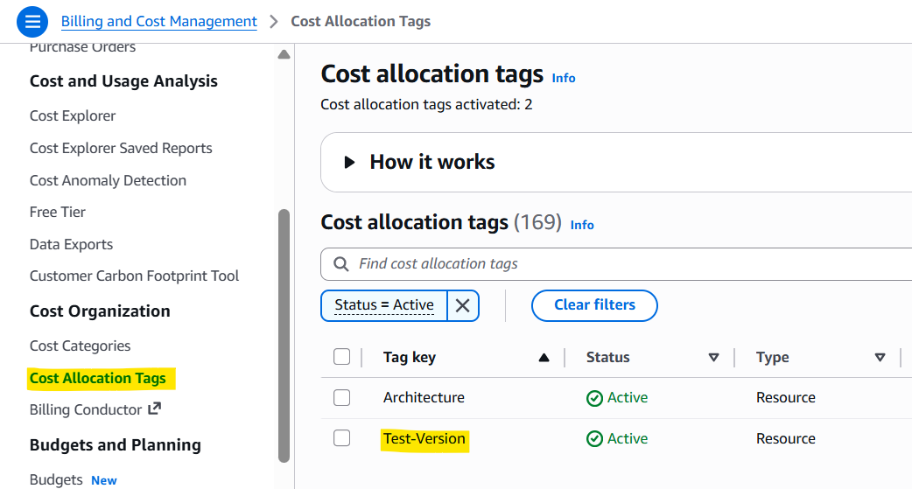

# FinOps & Cost Management

[Back](../README.md)

- [FinOps \& Cost Management](#finops--cost-management)
  - [Common FinOps Practices](#common-finops-practices)
  - [FinOps in This Project](#finops-in-this-project)
    - [What's Already in Place](#whats-already-in-place)
    - [Lesson Learned: Empty Tag Value from GitHub Actions Variable](#lesson-learned-empty-tag-value-from-github-actions-variable)
    - [Further FinOps Improvements for Production](#further-finops-improvements-for-production)
  - [Cost Estimation by Architecture](#cost-estimation-by-architecture)
    - [Baseline](#baseline)
    - [Scale](#scale)
    - [Redis](#redis)
    - [Kafka](#kafka)
    - [Per-Run Cost (Benchmark, ~27 min)](#per-run-cost-benchmark-27-min)
    - [AWS Pricing Calculator](#aws-pricing-calculator)

---

## Common FinOps Practices

| Practice                     | What It Means                                                                     | When to Apply                                                            |
| ---------------------------- | --------------------------------------------------------------------------------- | ------------------------------------------------------------------------ |
| **Right-sizing**             | Match task vCPU/memory to actual demand — Fargate bills exact allocation          | Always; use CloudWatch Container Insights to validate task utilization   |
| **Fargate Savings Plans**    | Commit to a compute spend level ($/hr) for 1–3 years; up to 52% off On-Demand     | Stable, predictable production baseline task counts                      |
| **Fargate Spot**             | Use spare Fargate capacity at up to 70% discount; 2-min interruption notice       | Stateless workloads: load test runners, batch jobs, non-critical workers |
| **ECS Service Auto Scaling** | Pay only for tasks running at any given moment; scale to zero during off-hours    | Variable traffic workloads                                               |
| **Auto tear-down**           | Destroy infrastructure when not in use so you aren't billed for idle resources    | Benchmarks, ephemeral environments                                       |
| **Cost Allocation Tags**     | Tag every resource (`project`, `environment`, `owner`) to trace spend by workload | All environments; tag before provisioning                                |
| **Cost Explorer + Budgets**  | Visualize spend by service and set alert thresholds before a surprise bill        | Production; set alerts at sensible dollar thresholds                     |
| **Hidden cost awareness**    | NAT Gateway ($0.05/hr + $0.05/GB) and cross-AZ data transfer ($0.01/GB) add up    | Any architecture with private subnets or multi-AZ deployments            |

---

## FinOps in This Project

### What's Already in Place

**ECS Service Auto Scaling**
ECS tasks scale out under load and back in when traffic drops. The benchmark showed the Scale architecture peaking at 18 tasks and returning to a low baseline — paying only for burst capacity when needed, not running 18 tasks statically. Unlike EC2-based EKS, Fargate means there are no idle node hours; billing stops as soon as tasks are stopped.

**No EC2 Node Management**
With ECS Fargate, there are no EC2 worker nodes to provision, patch, or pay for when idle. The ECS control plane itself has no fee — compared to EKS ($0.10/hr, ~$73/mo flat), this alone saves ~$73/mo per cluster regardless of workload size.

**Automated tear-down in the pipeline**
Every benchmark run follows: provision → smoke test → load test → destroy. Infrastructure exists only for the ~27-minute test window. Leaving Fargate tasks, RDS, and MSK running idle overnight would cost hundreds of dollars per month for nothing.

**Cost Allocation Tags**
Resources are tagged at provisioning time to enable per-architecture cost tracking in AWS Cost Explorer.

---

### Lesson Learned: Empty Tag Value from GitHub Actions Variable

`Cost Allocation Tags` were correctly defined in Terraform and tag values were passed in via GitHub Actions variables — but the variable was left empty during development and never populated before running the benchmark. The tag key existed in AWS; the value was blank, so Cost Explorer filters returned no results.

Takeaway: tags must be validated at the value level, not just the key level. When tag values come from CI/CD variables, add an explicit check (e.g., a workflow input validation step or a Terraform variable `validation` block) to fail fast if a required tag value is missing, rather than silently tagging resources with an empty string.

---

### Further FinOps Improvements for Production

Based on the benchmark metrics, the following improvements are relevant if any of these architectures were promoted to production:

**Fargate Savings Plans**
Each architecture has a predictable minimum task count at steady state: Baseline runs 1–2 tasks, Redis runs ~3, Kafka runs ~2. A production deployment can commit a baseline compute spend ($/hr) to a 1-year Fargate Savings Plan for ~40–52% off On-Demand. Tasks that scale beyond the committed level revert to On-Demand pricing — so this is risk-free if sized at the minimum steady-state floor.

**Fargate Spot for Stateless Workers**
The k6 load generator is a stateless, interruptible workload — an ideal Fargate Spot candidate (up to 70% discount). If the architecture uses background worker tasks (e.g., Kafka consumer tasks), those can also run on Fargate Spot with graceful shutdown handling on the 2-minute SIGTERM notice. App-facing tasks serving live traffic and DB-adjacent components should stay On-Demand.

**Right-size Task Definitions**
Fargate bills exact vCPU and memory allocation per task, per second. Over-provisioned task definitions (e.g., 2 vCPU allocated but 0.3 vCPU used) are direct waste — unlike EC2 where unused node headroom is an amortized overhead. Use CloudWatch Container Insights to measure actual CPU and memory utilization per task, then right-size task definitions to fit the p95 utilization with a safety margin.

**AWS Cost Explorer + Budgets**
Set a monthly budget alert per environment. A reasonable starting threshold for a production ECS Fargate stack: alert at 80% of expected spend, hard-stop notification at 100%. This catches runaway scaling or forgotten resources before the invoice arrives. Tag-based filtering (by `architecture` tag) makes it easy to compare spend per design.

**Mind the Hidden Costs**
Two costs that don't appear in Fargate task pricing:

- **NAT Gateway**: Fargate tasks in private subnets use NAT Gateway to pull images from ECR and reach external APIs. Charged at $0.05/hr + $0.05/GB processed. High task churn (many task starts pulling large images) amplifies this — use ECR VPC endpoints to eliminate NAT costs for image pulls entirely.
- **Cross-AZ data transfer**: Fargate tasks and RDS in different Availability Zones pay $0.01/GB for traffic between them. With high RPS and a 1:1 read/write ratio (as in this benchmark), this adds up. Pin RDS and its primary consumer tasks to the same AZ where possible, or use RDS Proxy to pool connections efficiently.

---

## Cost Estimation by Architecture

Costs below are estimated for production-equivalent, always-on deployment (monthly). Each architecture adds components on top of the shared baseline.

All Fargate task estimates assume **1 vCPU + 2 GB memory** per task (us-east-1 On-Demand: $0.04048/vCPU-hr, $0.004445/GB-hr → **$0.0494/task-hr**). Task counts reflect steady-state averages, not benchmark peaks.

> Reference: [AWS Pricing Calculator](https://calculator.aws/#/)

### Baseline

| Service               | Configuration              | Pricing Basis              | Usage Monthly | Est. Monthly |
| --------------------- | -------------------------- | -------------------------- | ------------- | ------------ |
| Elastic Load Balancer | 1 ALB                      | $0.02475/hr                | 730 hours     | ~$18         |
| NAT Gateway           | 1 AZ                       | $0.05/hr                   | 730 hours     | ~$36.50      |
| RDS PostgreSQL        | 1 db.t4g.medium, single-AZ | $0.07/hr                   | 730 hours     | ~$51.1       |
| ECS Fargate           | 1 tasks × (1 vCPU, 2 GB)   | ($0.04456/hr,$0.004865/hr) | 730 hours     | ~$39.63      |
| **Total**             |                            |                            |               | **~$145**    |

---

### Scale

| Service               | Configuration              | Pricing Basis              | Usage Monthly | Est. Monthly |
| --------------------- | -------------------------- | -------------------------- | ------------- | ------------ |
| Elastic Load Balancer | 1 ALB                      | $0.02475/hr                | 730 hours     | ~$18         |
| NAT Gateway           | 1 AZ                       | $0.05/hr                   | 730 hours     | ~$36.50      |
| RDS PostgreSQL        | 1 db.t4g.medium, single-AZ | $0.07/hr                   | 730 hours     | ~$51.1       |
| ECS Fargate           | 18 tasks × (1 vCPU, 2 GB)  | ($0.04456/hr,$0.004865/hr) | 730 hours     | ~$713.37     |
| **Total**             |                            |                            |               | **~$819**    |

---

### Redis

| Service               | Configuration              | Pricing Basis              | Usage Monthly | Est. Monthly |
| --------------------- | -------------------------- | -------------------------- | ------------- | ------------ |
| Elastic Load Balancer | 1 ALB                      | $0.02475/hr                | 730 hours     | ~$18         |
| NAT Gateway           | 1 AZ                       | $0.05/hr                   | 730 hours     | ~$36.50      |
| RDS PostgreSQL        | 1 db.t4g.medium, single-AZ | $0.07/hr                   | 730 hours     | ~$51.1       |
| ECS Fargate           | 16 tasks × (1 vCPU, 2 GB)  | ($0.04456/hr,$0.004865/hr) | 730 hours     | ~$634.11     |
| ElastiCache           | 1 × cache.t4g.micro        | $0.018/hr                  | 730 hours     | ~$13.14      |
| **Total**             |                            |                            |               | **~$753**    |

---

### Kafka

| Service               | Configuration              | Pricing Basis              | Usage Monthly | Est. Monthly |
| --------------------- | -------------------------- | -------------------------- | ------------- | ------------ |
| Elastic Load Balancer | 1 ALB                      | $0.02475/hr                | 730 hours     | ~$18         |
| NAT Gateway           | 1 AZ                       | $0.05/hr                   | 730 hours     | ~$36.50      |
| RDS PostgreSQL        | 1 db.t4g.medium, single-AZ | $0.07/hr                   | 730 hours     | ~$51.1       |
| ECS Fargate           | 10 tasks × (1 vCPU, 2 GB)  | ($0.04456/hr,$0.004865/hr) | 730 hours     | ~$396.32     |
| ElastiCache           | 1 × cache.t4g.micro        | $0.018/hr                  | 730 hours     | ~$13.14      |
| MSK (Kafka)           | 3 × kafka.t3.small         | $0.0508/hr                 | 730 hours     | ~$111.25     |
| **Total**             |                            |                            |               | **~$626**    |

---

> - Kafka costs the most to operate due to the fixed MSK broker cost, but eliminates DB overload risk — deferring the need for vertical DB scaling.
> - Scale task count is a production average estimate; benchmark peak was 18 tasks. Real production cost would follow traffic patterns.
> - Redis reduces DB CPU load (delaying the need to upsize RDS).

---

### Per-Run Cost (Benchmark, ~27 min)

| Architecture | Monthly Total | Est. Per Run | Annualized (1 run/week) |
| ------------ | ------------- | ------------ | ----------------------- |
| Baseline     | ~$145         | ~$0.09       | ~$5                     |
| Scale        | ~$819         | ~$0.50       | ~$26                    |
| Redis        | ~$753         | ~$0.46       | ~$24                    |
| Kafka        | ~$626         | ~$0.39       | ~$20                    |

> Per-run costs are prorated at 0.45 hrs (27 min) against each architecture's hourly rates. Fargate bills per second with a 1-minute minimum, so short benchmark runs benefit directly. Annualized figures assume one benchmark run per week (52 runs/year). Actual costs depend on region, data transfer volume, and AWS pricing changes.

> **Estimation scope notes:**
>
> - **Storage costs omitted**: RDS gp3 storage (~20 GB minimum, ~$2.30/mo) is not included. Consistent across architectures and small relative to compute costs.
> - **ALB LCU charges omitted**: Tables price only the ALB base hourly rate. At production-level RPS (1,000 req/s), LCU charges will exceed the base rate and vary with traffic; use the [AWS Pricing Calculator](https://calculator.aws/pricing/2/home) for a traffic-adjusted estimate.
> - **Task count is average-based**: Scale/Redis/Kafka task counts reflect estimated production averages. Benchmark peaks (18/16/10) would cost more during that window; use the per-task-hr rate to compute peak cost for a specific duration.
> - **ECR image pull NAT costs omitted**: First pull per task warms the local cache; subsequent pulls from the same task incur no NAT cost. High task churn environments should budget for this separately or use ECR VPC endpoints.

---

### AWS Pricing Calculator

To generate an accurate quote, use the [AWS Pricing Calculator](https://calculator.aws/) and add the following services:

- **Amazon ECS** — Fargate launch type; enter vCPU and memory per task, task count, and hours per month
- **Amazon RDS for PostgreSQL** — instance class, storage GB, single or multi-AZ
- **Amazon ElastiCache for Redis** — instance class (Redis architecture only)
- **Amazon MSK** — broker type, count, storage (Kafka architecture only)
- **Elastic Load Balancing** — Application Load Balancer; add LCU estimate for production RPS
- **AWS Data Transfer** — estimated GB/month outbound
- **AWS NAT Gateway** — hours + GB processed (reduce with ECR VPC endpoint)
