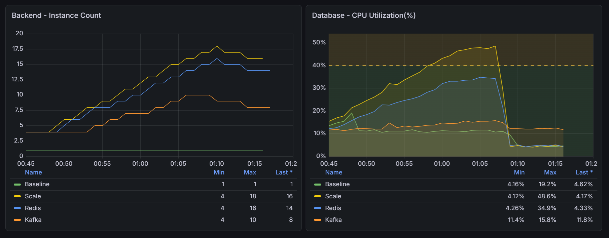

# Automated Architecture Benchmark (ECS) - Load Test Analysis

[Back](../../README.md)

- [Automated Architecture Benchmark (ECS) - Load Test Analysis](#automated-architecture-benchmark-ecs---load-test-analysis)
  - [Overview](#overview)
  - [Key Results](#key-results)
  - [What the Metrics Reveal](#what-the-metrics-reveal)
    - [Throughput \& Reliability](#throughput--reliability)
    - [Latency Behavior](#latency-behavior)
    - [Resource Efficiency (ECS Tasks)](#resource-efficiency-ecs-tasks)
    - [Database Pressure](#database-pressure)
  - [Behavior Differences](#behavior-differences)
  - [Key Takeaways](#key-takeaways)

---

## Overview

Under load, all optimized designs achieved 1000 RPS with near-zero failures, but behaved very differently:

- **Scale** handled load by increasing compute, but pushed heavy pressure onto the database
- **Redis** improved efficiency by reducing redundant database queries
- **Kafka** performed best by decoupling request handling from processing, achieving the lowest latency, lowest resource usage, and lowest database load

> **Conclusion:** Scaling solves throughput, caching improves efficiency, but async architecture (Kafka) fundamentally changes system behavior and provides the best overall balance.

---

## Key Results

| Architecture | Peak RPS | HTTP Failures | P95 Latency | ECS Tasks (Peak) | DB CPU |
| ------------ | -------- | ------------- | ----------- | ---------------- | ------ |
| Baseline     | 320      | 34.6%         | 3000ms      | 1                | 19.2%  |
| Scale        | 1000     | ~0%           | 70ms        | 18               | 48.6%  |
| Redis        | 1000     | ~0%           | 75ms        | 16               | 34.9%  |
| Kafka        | 1000     | ~0%           | 25ms        | 10               | 15.8%  |

---

## What the Metrics Reveal

### Throughput & Reliability

- `Baseline` fails under load → system cannot handle concurrency
- Other designs sustain 1000 RPS → scaling or decoupling is required

---

### Latency Behavior

- `Scale` / `Redis` → similar latency (~70ms)
- `Kafka` → significantly lower latency (25ms)

> `Kafka` returns responses quickly because processing is asynchronous.

---

### Resource Efficiency (ECS Tasks)

- `Scale` → highest resource usage (18 tasks)
- `Redis` → reduced compute (16 tasks)
- `Kafka` → lowest resource usage (10 tasks)

> Better design reduces the need for scaling.

---

### Database Pressure

- `Scale` → highest DB load (48.6%) → bottleneck risk
- `Redis` → reduced DB pressure (34.9%)
- `Kafka` → minimal DB load (15.8%)

> Scaling increases downstream pressure, while caching and async reduce it.

---

## Behavior Differences

- `Baseline`
  **No scaling** → system **overload** → **high** failure rate

- `Scale`  
  Handles load by adding compute → shifts **bottleneck** to database

- `Redis`
  **Reduces** duplicate work → improves **read efficiency** and lowers DB usage

- `Kafka`
  **Decouples** request from processing → **smooths** traffic, reduces load, and improves response time

---

## Key Takeaways

- `Scaling` solves **throughput** but **increases database pressure** and cost
- `Caching` **reduces redundant** work and improves system efficiency
- `Kafka` achieves the best balance: **low latency, low cost, low DB load**
